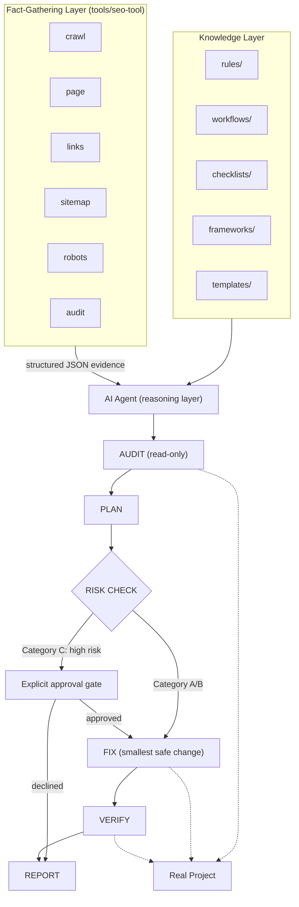

# SEO Engineering Skill

A reusable, framework-agnostic, agent-agnostic SEO engineering system. It's plain Markdown instructions plus a small zero-dependency CLI — no proprietary format, no lock-in to one AI product. Point any AI coding agent (Claude Code, or any other agent capable of reading local files and following instructions) at [`SKILL.md`](SKILL.md) and it inspects the target project's actual stack, architecture, and existing SEO implementation before doing any work — instead of applying one fixed methodology or requiring you to re-explain SEO fundamentals every time.

This is not a website. It contains no business-specific content, no fixture data, and no assumptions about any particular company, industry, or brand. It is the SEO system itself.

## The core principle

**SEO must never be more important than the existing application.** Existing functionality, business logic, user experience, security, and architecture always outrank an SEO improvement. See [SKILL.md](SKILL.md) and [rules/zero-breakage.md](rules/zero-breakage.md).

## Structure

| Directory | Contents |
|---|---|
| [`SKILL.md`](SKILL.md) | The master controller — read this first. Explains the operating loop, routes requests to the right workflow, and summarizes every safety constraint. |
| [`rules/`](rules) | Non-negotiable safety and quality constraints, applied across all work. |
| [`workflows/`](workflows) | Step-by-step procedures for every SEO domain (technical, on-page, content, schema, e-commerce, local, international, and more). |
| [`checklists/`](checklists) | Flat, checkable audit and pre-completion lists. |
| [`templates/`](templates) | Standard output formats for reports, plans, and roadmaps. |
| [`frameworks/`](frameworks) | Stack-specific (Next.js, React, Vite, WordPress, static HTML) and site-type-specific (e-commerce, SaaS, local, blog, tool) technical guidance. |
| [`commands/`](commands) | Definitions for the `/seo audit`, `/seo implement`, `/seo content`, `/seo technical`, `/seo schema`, `/seo links`, `/seo backlinks`, `/seo monitor`, and `/seo full` operating modes. |
| [`docs/`](docs) | Installation, usage, and reference documentation for people setting this up. |
| [`tools/`](tools) | Optional, read-only local inspection CLI (`tools/seo-tool`, zero dependencies) that crawls a site and extracts real SEO facts — see [`docs/tooling.md`](docs/tooling.md). Never required; workflows fall back to manual/source inspection without it. |

## Architecture

The repository is two layers that stay strictly separate, reasoned over by an AI agent that applies a fixed loop to the real project. See [SKILL.md](SKILL.md) for the authoritative version of the loop and [rules/implementation-safety.md](rules/implementation-safety.md) for the full risk-category table.

**Knowledge layer** — the SEO reasoning itself, and the only place decisions are made: [`rules/`](rules), [`workflows/`](workflows), [`checklists/`](checklists), [`frameworks/`](frameworks), [`templates/`](templates).

**Fact-gathering layer** — [`tools/seo-tool`](tools/seo-tool), a read-only CLI (`crawl`, `page`, `links`, `sitemap`, `robots`, `audit`, plus a `project` command for local source inspection) that fetches real pages, `sitemap.xml`, and `robots.txt`, then extracts structured JSON evidence — see [docs/tooling.md](docs/tooling.md). **These tools only collect and report facts. They never decide severity, priority, or what to do about a finding** — that interpretation always happens in the knowledge layer, applied by the agent.

The agent reasons over both layers together and runs this loop against the target project:

```
AUDIT (read-only) → PLAN → RISK CHECK → FIX (smallest safe change) → VERIFY → REPORT
```

Every change is sorted into a risk category before it happens (`rules/implementation-safety.md`). Category A (safe, additive) and Category B (moderate, reversible) proceed through FIX directly. **Category C — hard to reverse, large blast radius, or adjacent to protected functionality such as routing, rendering strategy, or auth — always stops at an explicit approval gate before implementation**, requiring the agent to explain the risk and get a specific yes. Category D (external systems like DNS or Search Console) is never implemented, only reported.



## What it can do

Technical SEO audits, on-page optimization, keyword research and search-intent analysis, information architecture and internal linking, content strategy and content optimization, programmatic SEO risk evaluation, structured data (Schema.org/JSON-LD), sitemap and robots.txt management, indexing diagnosis, Core Web Vitals-relevant performance review, JavaScript/SPA rendering audits across CSR/SSR/SSG/ISR, e-commerce, SaaS, local, international, and multilingual SEO, image SEO, ethical backlink/authority strategy, competitor analysis, Google Search Console workflows, monitoring cadence, post-implementation verification, and stakeholder-ready reporting.

## External SEO Work

This repository is built to handle the SEO engineering work that can be inspected, verified, and safely implemented from the project's own source, rendered output, and public site — technical SEO, on-page signals, structured data, internal linking, and content quality, all grounded in real evidence via the `AUDIT → PLAN → RISK CHECK → FIX → VERIFY → REPORT` loop above.

Some important SEO work cannot be completed from a repository at all — it depends on external platforms, external data, or the business itself. This section names that boundary explicitly, so a gap here is read as "not verifiable from this repository," not as a bug or an unfinished feature.

### 1. Google Search Console

The agent cannot obtain live Search Console data from this repository — see [workflows/search-console.md](workflows/search-console.md). External access may be required for:

- indexing status
- actual search queries
- impressions, clicks, CTR, average position
- page-level search performance
- submitted sitemap status
- coverage/indexing issues Google itself reports

The repository can prepare and validate the technical side — sitemap correctness, robots.txt, canonical tags, and indexability signals ([`tools/seo-tool`](tools/seo-tool)'s `sitemap`, `robots`, and `audit` commands; [workflows/technical-seo.md](workflows/technical-seo.md); [workflows/indexing.md](workflows/indexing.md)) — but the verification, submission status, and performance data themselves live in Search Console.

### 2. Analytics / Search Performance Data

Real user and search behavior requires external data this repository has no access to:

- organic traffic
- landing-page performance
- conversions from organic search
- engagement/conversion behavior
- business KPIs tied to organic traffic

None of these can be determined from source code or a crawl. See [rules/verification-rules.md](rules/verification-rules.md) on the distinction between what's verified locally and what requires real-world, time-based external confirmation.

### 3. Keyword Research and Search Demand

[workflows/keyword-research.md](workflows/keyword-research.md) and [workflows/search-intent.md](workflows/search-intent.md) reason about topic clusters, intent, and cannibalization, but this repository has no live keyword database of its own. External research may be required for:

- search volume
- keyword difficulty/competition
- current SERP landscape
- keyword trends
- commercial intent signals
- geographic search demand

Keyword decisions should be grounded in real Search Console data or an actual keyword tool where available. Absent that, any estimate is labeled as reasoned inference, not measured data — see `workflows/keyword-research.md`'s "Inputs this skill can and cannot access."

### 4. Competitor / SERP Research

[workflows/competitor-analysis.md](workflows/competitor-analysis.md) can inspect a named competitor's public pages, visible structured data, and content — but crawling a competitor's site is not complete competitive SEO intelligence. Important analysis may still require external search results and SEO data:

- current SERP competitors for a given query
- competitor content coverage at scale
- competitor page structures across their catalog
- competitor search visibility/ranking history
- SERP features currently appearing for a query
- content gaps confirmed against actual search results, not one competitor's site alone

### 5. Backlink / Off-Page Authority Data

[workflows/backlink-strategy.md](workflows/backlink-strategy.md) provides ethical link-earning strategy, but this repository has no live backlink index. External tools/data may be required for:

- backlink profile analysis
- referring domains
- lost/new backlinks
- competitor backlink analysis
- link authority analysis

This repository never recommends spam, link schemes, paid link manipulation, automated link building, or other black-hat tactics to close this gap — see [rules/no-black-hat.md](rules/no-black-hat.md). The gap is closed with real data, or not at all.

### 6. Google Business Profile / Local Business Data

For local SEO ([workflows/local-seo.md](workflows/local-seo.md)), some work requires the actual business profile and real business information, which this repository cannot access or manage:

- Google Business Profile verification/management
- profile completeness
- business category selection
- local business information
- reviews and review management
- local visibility/performance data

This repository never invents reviews, ratings, locations, business hours, or other business facts to fill this gap — see [rules/no-fabrication.md](rules/no-fabrication.md). Missing real data is requested from the user, never fabricated.

### 7. Business / Client Information

Some SEO decisions cannot safely be determined from code alone, per [rules/no-fabrication.md](rules/no-fabrication.md):

- actual products/services offered
- target customers
- geographic markets served
- business priorities
- conversion goals
- preferred terminology/voice
- legal/compliance requirements
- which pages/products should actually be indexable

The agent requests or verifies this information rather than guessing — see `docs/usage.md`'s "Providing information the skill can't derive from code."

### 8. External Infrastructure

Some technical SEO fixes require access outside this repository entirely:

- DNS
- domain configuration
- hosting/CDN configuration
- HTTP server configuration
- redirects configured at the infrastructure level
- SSL/TLS configuration
- Search Console property verification
- third-party platform settings

These are reported as external configuration work, per `SKILL.md`'s "When something is out of safe reach" — never worked around with a code-only substitute that won't actually take effect.

## Important Boundary

**This SEO Toolkit handles the evidence-driven SEO engineering that can be inspected and implemented within the project or site itself. External SEO platforms and business context provide the data and decisions that source inspection alone cannot establish.**

- Missing external access is **not automatically an SEO problem** — it's a gap in what this repository alone can verify, which is a different thing.
- The agent distinguishes **"not verifiable from this repository"** from **"confirmed SEO problem"** in every report — see `templates/seo-audit-report.md`'s "Out of Scope / Not Evaluated" and "External Configuration Required" sections.
- The agent never fabricates an external metric (a ranking, a traffic number, a search volume, a review count) to fill a gap — see [rules/no-fabrication.md](rules/no-fabrication.md) and [rules/verification-rules.md](rules/verification-rules.md).
- External dependencies are reported with the label that matches the actual kind of gap: **External Configuration Required** (infrastructure/platform actions — DNS, CDN, Search Console settings; already a named section in `templates/change-report.md` and `templates/seo-audit-report.md`), **External Data Required** (real external data this repository can't fetch — rankings, traffic, keyword volume, backlink data), or **Business Input Required** (facts only the business can supply — NAP data, target markets, priorities).

## Safety mechanisms

- **Zero-breakage policy** — existing functionality always wins over SEO gains.
- **No black-hat technique, ever** — no cloaking, doorway pages, keyword stuffing, hidden text, link schemes, or fake reviews, even if explicitly requested.
- **No fabrication** — business facts, statistics, reviews, dates, and authorship must be real and verifiable; missing data is requested from the user, never invented.
- **UI and architecture preservation** — no redesigns, no framework/build migrations, unless explicitly asked.
- **Eight-phase implementation discipline** — inspect, plan, risk-check, implement the smallest safe version, verify, inspect the diff, regression-check, report — for every change, regardless of size.
- **Explicit confirmation gate** — anything touching protected functionality (auth, payments, APIs, database, realtime, business logic) or hard to reverse stops for user sign-off before implementation.
- **Audit/implement separation** — `/seo audit` never modifies files; only `/seo implement` and other implementation-class commands do, and only after planning.

See [docs/safety.md](docs/safety.md) for the full breakdown.

## Installing this into a project

See [docs/installation.md](docs/installation.md). In short: copy this folder into the target project (or a global location your agent reads from), keep the internal structure intact, point your AI agent at `SKILL.md`, and start a session — no configuration step is required. Claude Code users get automatic discovery for free via the `SKILL.md` convention; every other agent works the same way once it's told to read the file.

## Using it

See [docs/usage.md](docs/usage.md). Just ask for SEO work in plain language ("audit our SEO," "why isn't this page indexing," "what content should we write next") or use the `/seo *` commands if your agent supports named/slash commands. The first action is always inspecting the actual project — you never need to explain your site or your SEO priorities from scratch.

## Limitations (be aware of these)

- The full list of SEO work that requires external platforms, external data, or business input — Search Console, analytics, keyword/backlink tools, competitor SERP data, Google Business Profile, and business/infrastructure facts — is documented in [External SEO Work](#external-seo-work) above. This repository never fabricates a substitute for any of it.
- Deliberately conservative on anything hard to reverse or touching protected functionality — this trades some speed for safety by design, not by oversight (see the Category C gate in [Architecture](#architecture) above).

## Recommended improvements for a future version

- A lightweight local crawler/link-checker utility script (bundled, not a live external service) to make `workflows/technical-seo.md` and `checklists/technical-checklist.md` audits less manual for larger sites.
- Direct integration hooks for Search Console/analytics data import, if a connected tool becomes reliably available, to make `workflows/search-console.md` less dependent on manual data hand-off.
- A machine-readable findings format (e.g., structured JSON alongside the Markdown reports) so audit output can feed a ticketing system or dashboard directly.
- Expanded `frameworks/` coverage for additional meta-frameworks (SvelteKit, Remix, Nuxt-specific detail) as they see wider real-world adoption, following the same template as the existing guides.
