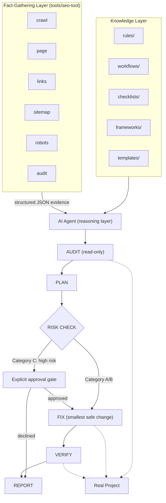

# SEO Engineering Skill

A reusable, framework-agnostic, agent-agnostic SEO engineering system. It's plain Markdown instructions plus a small zero-dependency CLI — no proprietary format, no lock-in to one AI product. Point any AI coding agent (Claude Code, or any other agent capable of reading local files and following instructions) at [`SKILL.md`](SKILL.md) and it inspects the target project's actual stack, architecture, and existing SEO implementation before doing any work — instead of applying one fixed methodology or requiring you to re-explain SEO fundamentals every time.

This is not a website. It contains no business-specific content, no fixture data, and no assumptions about any particular company, industry, or brand. It is the SEO system itself.

## The core principle

**SEO must never be more important than the existing application.** Existing functionality, business logic, user experience, security, and architecture always outrank an SEO improvement. See [SKILL.md](SKILL.md) and [rules/zero-breakage.md](rules/zero-breakage.md).

## Structure

| Directory | Contents |
|---|---|
| [`SKILL.md`](SKILL.md) | The master controller — read this first. Explains the operating loop, routes requests to the right workflow, and summarizes every safety constraint. |
| [`rules/`](rules) | Non-negotiable safety and quality constraints, applied across all work. |
| [`workflows/`](workflows) | Step-by-step procedures for every SEO domain (technical, on-page, content, schema, e-commerce, local, international, and more). |
| [`checklists/`](checklists) | Flat, checkable audit and pre-completion lists. |
| [`templates/`](templates) | Standard output formats for reports, plans, and roadmaps. |
| [`frameworks/`](frameworks) | Stack-specific (Next.js, React, Vite, WordPress, static HTML) and site-type-specific (e-commerce, SaaS, local, blog, tool) technical guidance. |
| [`commands/`](commands) | Definitions for the `/seo audit`, `/seo implement`, `/seo content`, `/seo technical`, `/seo schema`, `/seo links`, `/seo backlinks`, `/seo monitor`, and `/seo full` operating modes. |
| [`docs/`](docs) | Installation, usage, and reference documentation for people setting this up. |
| [`tools/`](tools) | Optional, read-only local inspection CLI (`tools/seo-tool`, zero dependencies) that crawls a site and extracts real SEO facts — see [`docs/tooling.md`](docs/tooling.md). Never required; workflows fall back to manual/source inspection without it. |

## Architecture

The repository is two layers that stay strictly separate, reasoned over by an AI agent that applies a fixed loop to the real project. See [SKILL.md](SKILL.md) for the authoritative version of the loop and [rules/implementation-safety.md](rules/implementation-safety.md) for the full risk-category table.

**Knowledge layer** — the SEO reasoning itself, and the only place decisions are made: [`rules/`](rules), [`workflows/`](workflows), [`checklists/`](checklists), [`frameworks/`](frameworks), [`templates/`](templates).

**Fact-gathering layer** — [`tools/seo-tool`](tools/seo-tool), a read-only CLI (`crawl`, `page`, `links`, `sitemap`, `robots`, `audit`, plus a `project` command for local source inspection) that fetches real pages, `sitemap.xml`, and `robots.txt`, then extracts structured JSON evidence — see [docs/tooling.md](docs/tooling.md). **These tools only collect and report facts. They never decide severity, priority, or what to do about a finding** — that interpretation always happens in the knowledge layer, applied by the agent.

The agent reasons over both layers together and runs this loop against the target project:

```
AUDIT (read-only) → PLAN → RISK CHECK → FIX (smallest safe change) → VERIFY → REPORT
```

Every change is sorted into a risk category before it happens (`rules/implementation-safety.md`). Category A (safe, additive) and Category B (moderate, reversible) proceed through FIX directly. **Category C — hard to reverse, large blast radius, or adjacent to protected functionality such as routing, rendering strategy, or auth — always stops at an explicit approval gate before implementation**, requiring the agent to explain the risk and get a specific yes. Category D (external systems like DNS or Search Console) is never implemented, only reported.



## What it can do

Technical SEO audits, on-page optimization, keyword research and search-intent analysis, information architecture and internal linking, content strategy and content optimization, programmatic SEO risk evaluation, structured data (Schema.org/JSON-LD), sitemap and robots.txt management, indexing diagnosis, Core Web Vitals-relevant performance review, JavaScript/SPA rendering audits across CSR/SSR/SSG/ISR, e-commerce, SaaS, local, international, and multilingual SEO, image SEO, ethical backlink/authority strategy, competitor analysis, Google Search Console workflows, monitoring cadence, post-implementation verification, and stakeholder-ready reporting.

## Safety mechanisms

- **Zero-breakage policy** — existing functionality always wins over SEO gains.
- **No black-hat technique, ever** — no cloaking, doorway pages, keyword stuffing, hidden text, link schemes, or fake reviews, even if explicitly requested.
- **No fabrication** — business facts, statistics, reviews, dates, and authorship must be real and verifiable; missing data is requested from the user, never invented.
- **UI and architecture preservation** — no redesigns, no framework/build migrations, unless explicitly asked.
- **Eight-phase implementation discipline** — inspect, plan, risk-check, implement the smallest safe version, verify, inspect the diff, regression-check, report — for every change, regardless of size.
- **Explicit confirmation gate** — anything touching protected functionality (auth, payments, APIs, database, realtime, business logic) or hard to reverse stops for user sign-off before implementation.
- **Audit/implement separation** — `/seo audit` never modifies files; only `/seo implement` and other implementation-class commands do, and only after planning.

See [docs/safety.md](docs/safety.md) for the full breakdown.

## Installing this into a project

See [docs/installation.md](docs/installation.md). In short: copy this folder into the target project (or a global location your agent reads from), keep the internal structure intact, point your AI agent at `SKILL.md`, and start a session — no configuration step is required. Claude Code users get automatic discovery for free via the `SKILL.md` convention; every other agent works the same way once it's told to read the file.

## Using it

See [docs/usage.md](docs/usage.md). Just ask for SEO work in plain language ("audit our SEO," "why isn't this page indexing," "what content should we write next") or use the `/seo *` commands if your agent supports named/slash commands. The first action is always inspecting the actual project — you never need to explain your site or your SEO priorities from scratch.

## Limitations (be aware of these)

- No live access to keyword-volume tools, live rank trackers, or backlink-index tools unless the user supplies data or a connected tool is available in the session — this skill is explicit about labeling inferred estimates versus real measured data (see [workflows/keyword-research.md](workflows/keyword-research.md)).
- Cannot act on external systems directly — DNS, hosting/CDN configuration, Google Search Console actions, Google Business Profile management are reported as "External Configuration Required," not executed.
- Cannot verify live outcomes (actual indexing status, ranking changes, real Core Web Vitals field data, rich-result appearance) within a session — these are inherently external and take real time; the skill states this explicitly rather than claiming an outcome it can't confirm (see [rules/verification-rules.md](rules/verification-rules.md)).
- Deliberately conservative on anything hard to reverse or touching protected functionality — this trades some speed for safety by design, not by oversight.

## Recommended improvements for a future version

- A lightweight local crawler/link-checker utility script (bundled, not a live external service) to make `workflows/technical-seo.md` and `checklists/technical-checklist.md` audits less manual for larger sites.
- Direct integration hooks for Search Console/analytics data import, if a connected tool becomes reliably available, to make `workflows/search-console.md` less dependent on manual data hand-off.
- A machine-readable findings format (e.g., structured JSON alongside the Markdown reports) so audit output can feed a ticketing system or dashboard directly.
- Expanded `frameworks/` coverage for additional meta-frameworks (SvelteKit, Remix, Nuxt-specific detail) as they see wider real-world adoption, following the same template as the existing guides.
